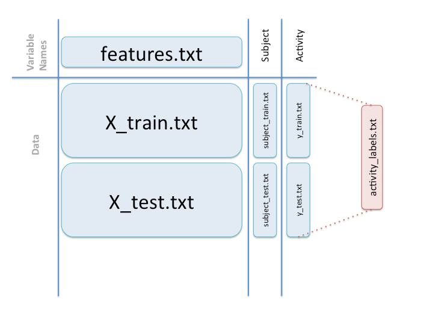

Code Book of Getting and Cleaning Data Course Project
-----------------------------------------------------

This is a code book that describes the variables, the data, and any 
transformations or work that has been done to clean up the data.

### The data cleanup script does the following: 

Signals Inertial data are not considered because these are obtained from the
treated here.

1. The working directory is set

2. We review whether the UCI HAR Dataset directory exists, if not exist that 
   directory, the getdata-projectfiles-UCI HAR Dataset.zip file is decompressed 
   to obtain it because the data to work is contained in it
   
3. Merges the training and the test sets to create one data set. Reads data 
   of X corresponding to train and test respectively, then the joint 
   in a data frame.

4. Extracts only the measurements on the mean and standard deviation for each
   measurement. Extracts data were obtained from the calculation of the average
   and the standard deviation.

5. Uses descriptive activity names to name the activities in the data set. 
   Change the numbers in the column for their respective activities activity 
   described in text mode. 

6. Appropriately labels the data set with descriptive activity names. It gets a 
   appropriate name column activities.

7. Creates a 2nd, independent tidy data set with the average of each variable
   for each activity and each subject. Averaging is performed subject to 
   each activity.

The following diagram summarizes how the data is organized between files 
provided:

